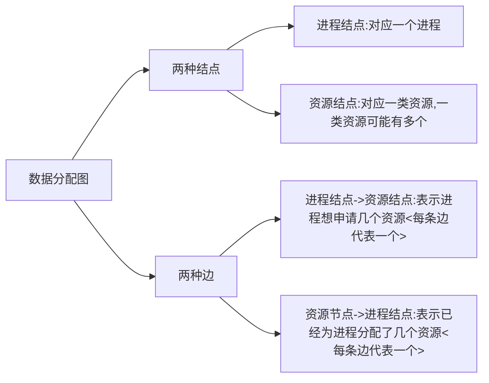

# 2. 死锁的检测和解除

## 资源分配图 ##

资源分配图是一种数据结构 : 

<!--more-->

如图:

## 用资源分配图判断系统是否死锁 ##

### 方法 : ###

### e.x. ###

没有死锁的资源分配图 :

死锁了的资源分配图 : 

## 死锁的解除 ##

### 资源剥夺法 ###

挂起(暂时放在外存)某些 **死锁** 进程, 并抢占它的资源, 让这些资源分配给其他的死锁进程, 注意需要防止被挂起的进程长时间得不到资源而饥饿

### 撤销进程法 ###

强制某些死锁进程, 并剥夺这些进程的资源.

优点 : 实现简单

缺点 : 代价大, 比如有些进程已经运行了很长时间甚至接近结束, 突然剥夺将功亏一篑

### 进程回退法 ###

让一个或多个死锁进程回退到足以避免死锁的地步

缺点 : 不太容易实现--系统需要记录进程的历史信息并设置还原点

可以根据 : 

- 进程优先级
- 已执行多长时间
- 还要多久能完成
- 已经使用了多少资源

等方式决定对那个死锁进程执行解除方案

