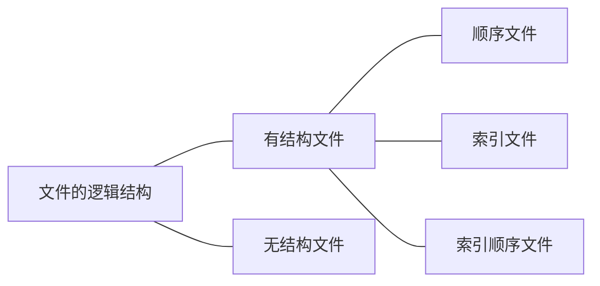

# 6. 文件管理

## 文件的简介

### 一个文件的属性 

- 文件名
- 标识符
- 类型
- 位置
- 大小
- 创建时间, 上次修改时间
- 文件所有者信息
- 保护信息

 

### 文件的分类

#### 无结构文件 ( 流式文件)

如文本文件, 由一些二进制或字符流组成

#### 有结构文件 ( 记录式文件 )

如数据库表, 由一组相似的记录组成, 又称 "记录式文件"

**记录** : 一组相关数据项的集合

### 操作系统应该向上提供的功能

- 创建文件---create系统调用
- 读文件---read系统调用
- 删除文件---delete系统调用
- 写文件---write系统调用

- 打开文件---open系统调用
- 关闭文件---close系统调用

## 文件的逻辑结构

这里重点讨论**有结构文件**

### 有结构文件

有结构文件由一组相似的记录组成, 又称**记录式文件** . 每条记录又由若干个数据项组成, 如数据库表文件.  一般来说, 每条记录有一个数据项可作为关键字. 根据各条记录的长度是否相等, 可分为**定长记录**和**可变长记录**两种.

#### 顺序文件

> 文件中的记录一个接一个地顺序排列( 逻辑上 ) , 记录可以是定长的或可变长的. 各个记录在物理上可以顺序存储或链式存储.

#### 索引文件

#### 索引顺序文件

索引顺序文件是索引文件和顺序文件思想的结合. 索引顺序文件中, 同样会为文件建立一张索引表, 但不同的是, 并不是每个记录都对应一个索引表, 而是**一组记录对应一个索引表项** 

- 当记录过多的时候可以建立多级索引表

## 文件目录

 

### 文件控制块FCB

### 单级目录结构

早期的操作系统并不支持多级目录, 整个系统只建立一张目录表, 每个文件占一个目录项

单级目录实现了"按名存取", 但是不允许文件重名

单级目录不支持多用户操作系统

### 两级目录结构

早期的多用户操作系统采用两级目录结构, 分为**主文件目录**和**用户文件目录**.

### 多级目录结构 ( 树形目录结构 )

 

- 理解 : 相对目录可以减少磁盘I/O操作次数

### 无环图目录结构

### 索引结点 ( FCB的改进 ) 

将fcb除了文件名之外的所有信息放入索引结点存在外存, 只有找到对应的目录项时才将索引节点调入内存.

## 文件的物理结构

### 文件块和磁盘块

在内存管理中, 进程的逻辑地址空间被分为一个个的页面

同样的, 在外存管理中, 为了方便对文件数据的管理, 文件的逻辑地址空间也被分为了一个个的文件块

于是文件的逻辑地址也可以表示为  **(逻辑块号, 块内地址)**的形式

 

### 文件分配方式---连续分配

连续分配方式要求每个文件**在磁盘上占有一组连续的块**

操作系统可以直接算出逻辑块号对应的物理块号, 因此连续分配支持顺序访问和直接访问( 随机访问 )

优点 : 

> 连续分配的文件在顺序读/写时**速度最快**

缺点 : 

> 采用连续分配的文件**不方便拓展** 
>
> 存储利用率低, 会**产生难以利用的磁盘碎片**. ( 可以采用紧凑的方法来处理碎片, 但是需要耗费很大的时间代价 ) 

### 文件分配方式---链接分配

#### 隐式链接

采用隐式链接的链接分配方式, 很方便**文件拓展** , 另外, **所有的空闲磁盘块**都可以被利用, 不会有碎片问题, 外存利用率高

#### 显式链接 

### 文件分配方式---索引分配

文件离散地分配在各个磁盘块中, 系统为每个文件建立一张索引表, 索引表中记录了文件的各个逻辑块对应的物理块. 索引表存放的磁盘块称为**索引块**, 文件数据存放的磁盘块称为**数据块** .

- 索引分配方式可以支持**随机访问**, 文件拓展也很容易实现, 但是索引表需要占用一定的存储空间

#### 多层索引

- K层索引访问一个数据块需要**K+1**次读磁盘操作

- 多层索引的各层索引大小不能超过一个磁盘块

- 会计算文件的长度

#### 混合索引

混合索引是多种分配方式的结合

e.g.

一个文件的顶级索引表中既包含**直接地址索引** , 又包含**一级间接索引** ,还包含**两级间接索引** ... 

好处 : 对于小文件来说只需要很少的读磁盘操作

## 文件存储空间管理

### 空闲表法

空闲表记录空闲盘块号的起始地址和空闲块数

- 要求 : 连续的存储空间

- 如何分配磁盘块 : 与内存管理的动态分区类似, 为一个文件分配连续的存储空间. 同样可以采用**首次适应** , **最佳适应** , **最坏适应**等算法.

- 如何回收磁盘块 : 

### 空闲链表法

1. **空闲盘块链** 

2. **空闲盘区链** 

### 位示图法

### 成组链接法

UNIX系统采用了成组链接法对空闲块进行管理

[讲的很好的一篇图文结合博客](<https://blog.csdn.net/Ajay666/article/details/73569654>)

 

## 文件的基本操作

### 创建文件

使用 **"create系统调用"** 

1. 在外存中找到文件所需的时间
2. 根据文件的存放路径的信息找到该目录对应的目录文件, 在目录中创建该文件对应的目录项 ( 目录项中包含了文件名, 文件在外存中的存放位置等信息 )

### 删除文件

使用 **"delete系统调用"** 

### 打开文件

- 打开文件表

  - 读写指针 ：读 / 写操作进行到的位置记录
  - 访问权限  : 只读 / 只写 / 可读可写....

  打开文件时不会把文件的数据直接读入内存 ( 读文件时才读入内存 )

### 关闭文件

### 读文件, 写文件

## 文件共享 

> 多个用户共享同一个文件, 意味着系统中只有 "一份" 文件数据 . 并且只要某个用户改了该文件的数据, 其他用户也可以看到文件数据的变化.

### 基于索引结点的共享方式 ( 硬链接 )

**删除** : 

### 基于符号链的共享方式 ( 软连接 )

e.g.

windows下的快捷方式

## 文件保护

1. **口令保护** ( 口令放在系统中, 不太安全 ) 

2. **加密保护** ( 安全性高, 但加密 / 解密 需要耗费一定的时间
3. **访问控制**

## 文件系统的层次结构

e.g. 

 