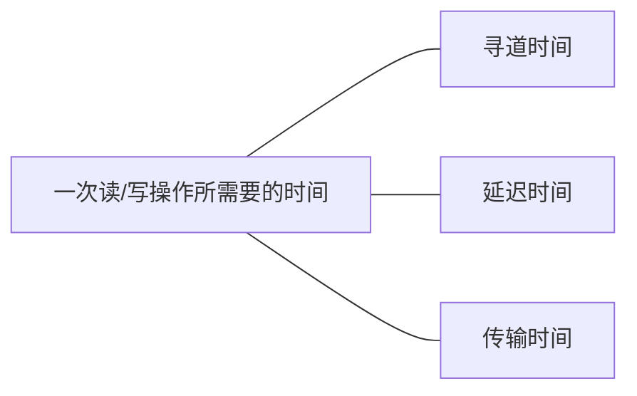

# 7. 磁盘

## 磁盘的结构

### 磁盘, 磁道, 扇区

磁盘的表面由一些磁性物质组成, 可以用这些磁性物质来记录二进制数据

**磁道** : 磁盘的盘面被划分成一个个磁道, 一个圈就是一个磁道

**扇区** : 每一个磁道被划分成一个个扇区,  每个扇区就是一个个 " 数据块 ", 各个扇区**存放的数据量相同**

( 最**内侧**磁道上的扇区面积最小, 因此数据密度最大 )

### 数据的读写

### 盘面, 柱面

如何根据地址读取一个块 : 

### 磁盘的分类

根据磁头是否可以移动 : 

1. 活动头磁盘

   

2. 固定头磁盘

根据盘片是否可以更换 : 

1. 固定盘磁盘
2. 可换盘磁盘

## 磁盘调度算法 ( 寻道时间 )

### 一次读 / 写操作所需要的时间

#### 寻找时间 (寻道时间) 

> 在读 / 写数据之前, 把磁头移动到指定磁道所花的时间

- 启动磁头臂的时间
- 移动磁头的时间

####  延迟时间

> 通过旋转磁盘, 使磁头定位到目标扇区所需要的时间

#### 传输时间

> 由磁盘读出 或 向磁盘写入数据所需要的时间

**磁盘调度算法**会直接影响**寻道时间** 

### 先来先服务算法 FCFS

> 根据进程请求访问磁盘的先后顺序进行调度

### 最短寻找时间优先 SSTF

> ​	

- 可能产生 **饥饿** 现象

### 扫描算法 SCAN ( 电梯算法 )

SSTF算法产生饥饿的原因 : 磁头可能会在一个小区域内来回移动

SCAN : 

> 只有磁头移动到最外侧磁道的时候才能往内移动, 移动到最内侧磁道的时候才能往外移动

#### LOOK调度算法 ( SCAN的改进 )

在扫描算法的基础上增加 : 

> 如果在磁头移动方向上已经没有别的请求, 就可以立即改变磁头移动方向

#### 循环扫描算法 C-SCAN

> SCAN算法对于各个位置磁道的**响应频率**不平均, C-SCAN算法就是为了解决这个问题, 规定只有磁头朝特定方向移动时才处理磁道访问请求, 而返回时 **直接快速移动至起始端而不处理任何情况** 

#### C-LOOK 调度算法

**C-LOOK = C-SCAN + LOOK**

### 总结

## 减少磁盘 ( 延迟时间 ) 的办法

延迟时间 : 把目标扇区转动到磁头下所花的时间

由于磁头读入一个扇区数据后需要**一小段时间处理**, 如果逻辑上相邻的扇区在物理上也相邻, 则读入几个连续的逻辑扇区, 可能需要很长的 " 延迟时间 ".

### 交替编号

采用交替编号的策略, 让逻辑上相邻的扇区在物理上有一定的间隔,  可以使读取连续的逻辑扇区所需要的延迟时间更小

 ### 错位命名

 将盘面之间的扇区不同样按顺序编号

而是使用0号盘面的1号扇区下是1号盘面的4号扇区....这样的方式

这样使得读取完磁盘块之后还有一段时间处理, 从而减少了延迟时间

### 磁盘地址结构的设计

采用 ( 柱面号, 盘面号, 扇区号 )--- 三维, 二维, 一维

## 磁盘管理

### 磁盘初始化

1. 进行**低级格式化** ( 物理格式化 ), 将磁盘的各个磁道划分为扇区, 一个扇区通常可分为头, 数据区, 尾三个部分. 管理扇区所需要的各种数据结构 ( 校验码等 )一般存放在头, 尾两个部分
2. 将**磁盘分区** , 每个分区由**若干柱面组成**
3. 进行**逻辑格式化**,  创建文件系统. 包括创建文件系统的根目录, 初始化

###  磁盘的引导块

> 计算机开机时需要进行一系列初始化的工作, 这些初始化工作是通过执行初始化程序 (自举程序) 完成的. 

初始化程序 ( 自举程序 ) 如果直接放在ROM中, 会很不方便, 因为ROM中的数据无法更改, 解决方法 : 

1. ROM中只存放很小的 " 自举装入程序 "

2. 开机时计算机先运行 " 自举装入程序 ", 通过执行该程序就可以找到引导块, 并将完整的" 自举程序 " 读入内存, 完成初始化

### 坏块的管理

对于`简单的磁盘` ,可以在逻辑格式化时, 对磁盘进行坏块检查, 表明哪些扇区是坏扇区. 这种处理方式中, 坏块**对操作系统不透明**

对于`复杂的磁盘` , 磁盘控制器 ( 磁盘设备内部的一个硬件部件 ) 会维护一个坏块链表. 在磁盘出厂前进行低级格式化时就将坏块链进行初始化. 会保留一些 " 备用扇区 " 用于替换坏块. 这种方案称为**扇区备用** . 这种处理方式中, 坏块**对操作系统透明**.