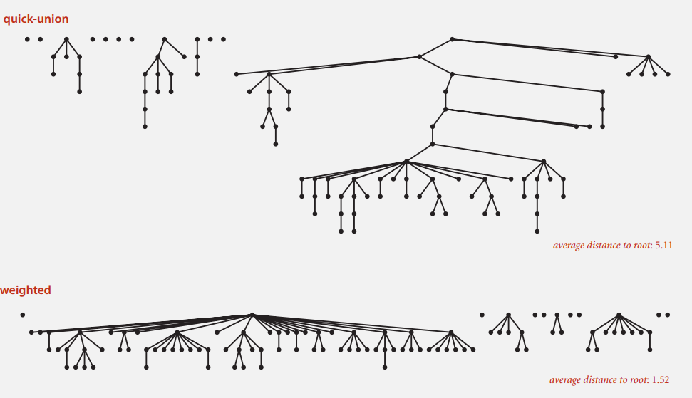

# 3.1 算法分析与union-find算法

> 作业: 1.4.2 1.4.4 1.4.5 1.4.6 1.4.15
>
> 1.5.1 1.5.2 1.5.3 1.5.8

- 如果为**近似**则保留系数, 例如$\frac{1}{2}\text{N}^2$ 

- 如果为**数量级**则不要系数, $\text{N}^2$

## 1 | 倍率实验

**倍率定理:** 

若$\text{T}\left( \text{N} \right) \sim \text{aN}^{\text{b}}\lg\text{N}$, 那么$\frac{\text{T}\left( 2\text{N} \right)}{\text{T}\left( \text{N} \right)}\sim 2^{\text{b}}$

将输入规模不断x2, 直到相邻两次时间之比近似为$2^b$时可以估计参数b, 估计大致的增长数量级

## 2 | union-find算法

> 掌握各个版本的轨迹和数组内容, 树结构的变化


### 2-1 quick-find

思想: 每次联通时将所有id[i]均联通

实现:

```cpp
int find(int p) {
	return id[p];
}

void union(int p, int q) {
    int pid = find(p);
    int qid = find(q);
    // p和q已经在相同的分量之中
    if (pid == qid) return;
    // 将p的分量重命名为qid
    for (int i = 0; i < id.length; ++i) {
        if (id[i] == qid) 
            id[i] = pid;
    }
}
```

### 2-2 quick-union

思想: 每次联通时只联通根节点

```cpp
int find (int p) {
    // 找根结点
	while (p != id[p])
        p = id[p];
    return p;
}

void union(int p, int q) {
    int proot = find(p);
    int qroot = find(q);
    if (proot == qroot) return;
    id[proot] = qroot;
}
```

### 2-3 weighted-quick-union

思想: 利用一个sz数组记录每棵树的大小, 并总是将较小的树连接到较大的树上

```cpp
int find (int p) {
	while (p != id[p])
        p = id[p];
}

void union(int p, int q) {
    int proot = find(p);
    int qroot = find(q);
   	if (proot == qroot) return;
    if (sz[proot] < sz[qroot]) {
        id[proot] = qroot;
        sz[qroot] += sz[proot];
    } else {
      	id[qroot] = proot;
        sz[proot] += sz[qroot];
    } 
}
```

quick-union和weighted-quick-union的对比:



### 2-4 路径压缩+quick-union

思想: 在查找根节点的同时将每个结点直接指向上上一级结点, 以达到扁平化的效果

```cpp
int find (int i) {
    while (i != id[i]) {
        id[i] = id[id[i]]; // 核心
        i = id[i];
    }
    return i;
}
```

