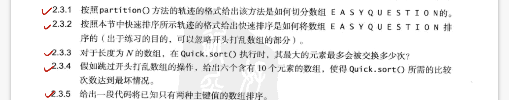
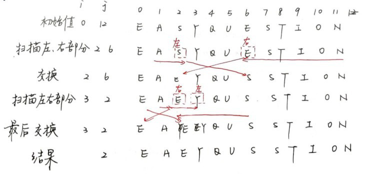
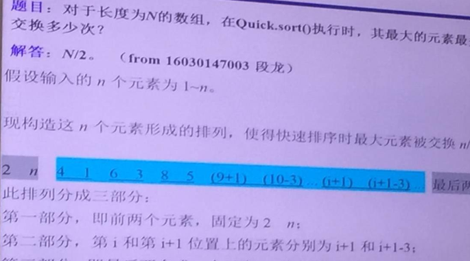

# 3.3 快速排序

> 作业: 2.3.1 2.3.2 2.3.3 2.3.4 2.3.5

## 1 | 算法

```cpp
void sort(int []a, int lo, int hi) {
	if (hi <= lo) return;
    int j = partition(a, lo, hi); //进行切分
    sort(a, lo, j - 1);
    sort(a, j + 1, hi);
}
```

### `partition`

切分使得数组满足如下条件: 

1. 对于某个j, a[j]已经确定
2. a[lo]到a[j-1]的所有元素不大于a[j]
3. a[j+1]到a[hi]的所有元素不小于a[j]

实现:

```cpp
int partition(int []a, int lo, int hi) {
	int i = lo, j = hi + 1;
    int v = a[lo]; // 切分元素
    while (1) {
		while (a[++i] < v) 
            if (i == hi) break; // 从左到右找到一个 >= v的元素
        while (v < a[--j])
            if (j == lo) break; // 从右到左找到一个 <= v的元素
        if (i >= j) break;
        swap(a, i, j); // 交换元素
    }
    swap(a, lo, j); // 将切分元素放到对应位置
    return j; // 返回切分元素的索引
}
```

## 2 | 算法改进

### 乱序

在每次排序之前将数组打乱并随机选取切分元素保证随机性

### 在小数组时候切换到插入排序

对于小数组而言, 插入排序比快速排序快

将

```cpp
if (hi <= lo) return;
```

改为

```cpp
if (hi <= lo + M) {
    insertion.sort(a, lo, hi); //切换到插入排序
    return;
}
```

其中M的值自定, 一般取5 - 15

### 三向切分

将数组分为三个部分, 分别对应小于, 等于和大于切分元素的数组元素                                                                                                                                                                                                                                                                                                                                                                                                                                                                                                                                                                                                                                                                                                                                                                                                                                                                                                                                                                                                                                                                                                                                                                                                                                                                                                                                                                                                                                                                                                                                                                                                                                                                                                                                                                                                                                                                                                                                                                                                                                                                                                                                                                                                                                                         

- a[lo...lt-1]上元素 < v

- a[lt...gt]上元素 = v

- a[gt+1...lo]上元素 > v

之后`sort(lo, lt-1)`和`sort(gt + 1, hi)`即可, 避免了很多对重复元素的操作

```cpp
void tsort(vector<int>& a, int lo, int hi) {
    if (hi <= lo) return;
    int lt = lo, i = lo + 1, gt = hi;
    int v = a[lo];
    while (i <= gt) {
        if (a[i] < v) swap(a[lt++], a[i++]);
        else if (a[i] > v) swap(a[i], a[gt--]);
        else ++i;
    }
    cout << lt << " " << gt << endl;
    tsort (a, lo, gt - 1);
    tsort (a, gt + 1, hi);
}
```

## 3 | 课后作业



### 2.3.1



### 2.3.2

```cpp
/**
*   author:     roccoshi
*   created:    2020-12-28 12:42:21
*/
#pragma GCC diagnostic ignored "-Wsign-conversion"
#pragma GCC diagnostic ignored "-Wsign-compare"
#include<bits/stdc++.h>
using namespace std;

int partition(vector<int>& a, int lo, int hi) {
    int i = lo, j = hi + 1;
    int v = a[lo]; // 切分元素
    while (1) {
        while (a[++i] < v) 
            if (i == hi) break; // 从左到右找到一个 >= v的元素
        while (v < a[--j])
            if (j == lo) break; // 从右到左找到一个 <= v的元素
        if (i >= j) break;
        swap(a[i], a[j]); // 交换元素
    }
    swap(a[lo], a[j]); // 将切分元素放到对应位置
    return j; // 返回切分元素的索引
}

void qsort(vector<int>& a, int lo, int hi) {
    if (lo >= hi) return;
    int j = partition(a, lo, hi);
    cout << "lo: " << lo << " hi: " << hi << " j: " << j << endl;
    qsort(a, lo, j - 1);
    qsort(a, j + 1, hi);
}


int main () {
    vector<int> a{'E','A','S','Y','Q','U','E','S','T','I','O','N'};
    qsort(a, 0, a.size() - 1);
    for (char i : a) {
        cout << i << " ";
    }
}

/*
lo: 0 hi: 11 j: 2
lo: 0 hi: 1 j: 1
lo: 3 hi: 11 j: 11
lo: 3 hi: 10 j: 4
lo: 5 hi: 10 j: 10
lo: 5 hi: 9 j: 5
lo: 6 hi: 9 j: 7
lo: 8 hi: 9 j: 9
A E E I N O Q S S T U Y
*/
```

### 2.3.3



### 2.3.4

顺序就是最坏情况

### 2.3.5

进行一次三向切分即可

