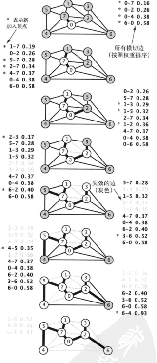
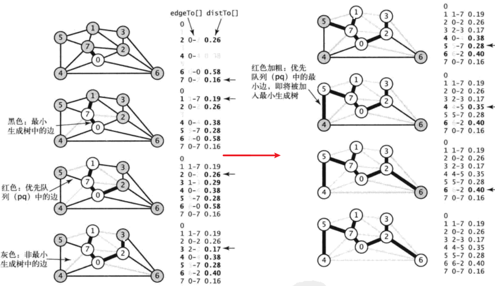

# 3.7 最小生成树mst

最小生成树: (Minimum Spanning Tree) MST

> 作业: 4.3.3 4.3.13 4.3.18

## 1 | Prim算法

### Prim算法的延时实现

#### 数据结构

```cpp
marked[v] = true // 表示顶点v在树中
    
edgeTo[v] // 将v连接到树中的Edge对象
```

横切边: 目前一端在树里一端不在的边

失效边: 两端都在树里的边

#### 流程

prim算法延时的流程: 

- 将起点和与起点相连的所有边压入最小堆优先队列
- 选出权重最小的边
- 判断是否已经在树中, 如不在, 压入mst, 并将其横切边都加入优先队列
- 重复上述步骤

延时实现的特点是**保留了失效边**, 即当新顶点加入树中时, 没有删除优先队列中那些两端都已经在最小生成树中的边



### Prim算法的即时实现

由于我们感兴趣的只是连接树顶点和非树顶点中权重最小的边, 当将顶点v添加到树中时, 非树顶点w产生的变化只可能使得w到最小生成树的距离更近了

所以我们不需要保存所有从w到树顶点的边而只需要**保存最小的那条**

在添加v顶点后检查是否需要更新那条最小的边即可

#### 数据结构

```cpp
// 将mst[]去除, 取代而之的是
Edge edgeTo[]
double distTo[]
// v不在树中但有和树相连的边, edgeTo[v]表示v和树相连的最短边, distTo[v]表示这条边的权重
```



## 2 | Kruskal算法

思路: 按照边的权值从小到大排列. 依次选中, 判断是否与当前mst构成环, 如果不成环则加入。

一种实现: 

```cpp
/**
*   author:     roccoshi
*   created:    2020-12-31 19:43:13
*/
#pragma GCC diagnostic ignored "-Wsign-conversion"
#pragma GCC diagnostic ignored "-Wsign-compare"
#include<bits/stdc++.h>
using namespace std;

const int N = 16;
vector<int> g;
vector<int> id;

typedef struct Edge {
    int v;
    int w;
    double weight;
}Edge;

// 小顶堆
auto cmp = [](const Edge& i, const Edge& j){return i.weight > j.weight;};
priority_queue<Edge, vector<Edge>, decltype(cmp)> pq(cmp);

int find(int w) {
    while (w != id[w]) {
        id[w] = id[id[w]];
        w = id[w];
    }
    return w;
}

bool connected(int w, int v) {
    return find(w) == find(v);
}

void merge(int w, int v) {
    int wr = find(w), wv = find(v);
    id[wr] = wv;
}

int main () {
    Edge e[N];
    for (int i = 0; i < N; ++i) {
        int w, v;
        double we;
        cin >> w >> v >> we;
        e[i].v = w;
        e[i].w = v;
        e[i].weight = we;
        pq.push(e[i]);
    }
    // while (!pq.empty()) { //  输出优先队列测试
    //     Edge e = pq.top();
    //     pq.pop();
    //     cout << e.w << " " << e.v << " " << e.weight << endl;
    // }
    for (int i = 0; i < N; ++i) {
        id.push_back(i);
    }
    while (!pq.empty()) {
        Edge e = pq.top();
        pq.pop();
        int v = e.v;
        int w = e.w;
        if (connected(v, w)) continue;
        merge(v, w);
        cout << "added: " << v << " " << w << " " << e.weight << endl;
    }
    return 0;
}

/*
4 5 0.35
4 7 0.37
5 7 0.28
0 7 0.16
1 5 0.32
0 4 0.38
2 3 0.17
1 7 0.19
0 2 0.26
1 2 0.36
1 3 0.29
2 7 0.34
6 2 0.40
3 6 0.52
6 0 0.58
6 4 0.93
*/
```

## 3 | 关于三种算法的复杂度

| 算法     | 空间 | 时间  |
| -------- | ---- | ----- |
| 延时Pirm | E    | ElogE |
| 即时Prim | V    | ElogV |
| Kruskal  | E    | ElogE |


