# 03. SQL

SQL与**三级模式**体系结构图:

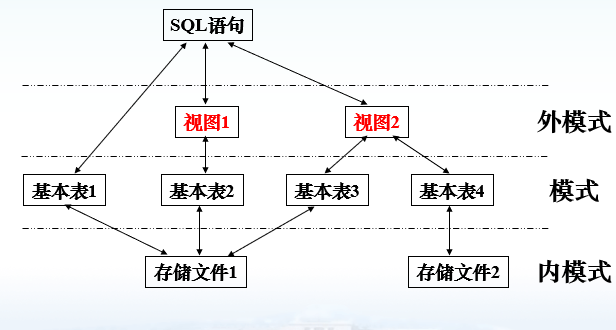

##  1 | 数据定义

SQL提供了专门的语言定义数据库对象, 称为**DDL**(数据定义语言, Data Definition Language)

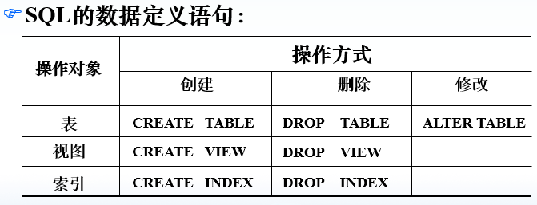

### 创建数据库

`CREATE DATABASE <name>`

### 创建基本表

格式

```sql
CREATE TABLE <表名>
(
    <列名> <数据类型> <列级完整性约束条件>,
    <列名> <数据类型> <列级完整性约束条件>,
   	...
    <表级完整性约束条件>
);
```

实例

```sql
create table S
    (
    SNO int not null primary key, -- 列级完整性约束
    SNAME char(10) not null,
    SA int not null,
    FNAME char(15) not null,
    CNO int not null,	
    SD char(10),
    constraint fk_fname1 foreign key(FNAME) references F(FNAME), -- 表级完整性约束, 命名约束
    foreign key(CNO) references C(CNO) -- 直接指定约束 (少了constraint xxx)
    );
```

常用的完整性约束:

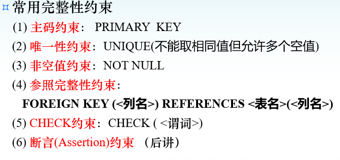

### 修改基本表

格式

```sql
ALTER TABLE <表名>
(
    ADD <新列名> <数据类型> <完整性约束>
    DROP <完整性约束名> <列名>
    ALTER <列名> <数据类型>
);
```

实例:

```sql
-- 增加属性
alter table student add senroll date;
-- 修改属性数据类型
alter table student alter sage smallint;
-- 删除约束
alter table student drop unique(name);
```

## 2 | 查询

语法:

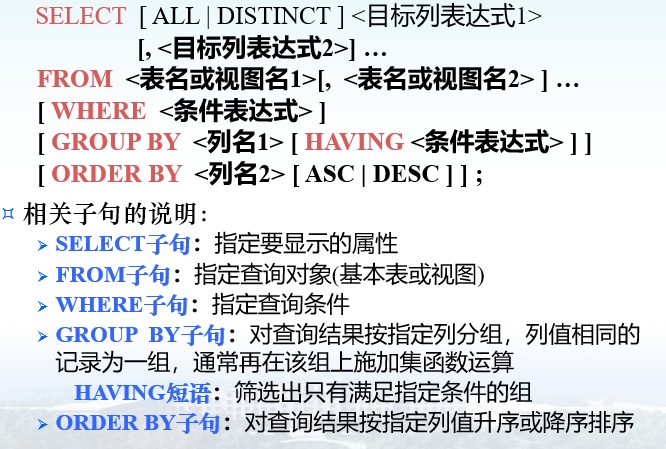

### where子句

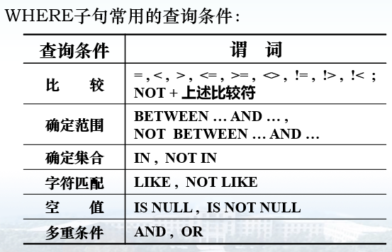

```sql
-- 例子
where age between 20 and 23;  -- 找年龄20-23岁的

where dept not in ('is', 'ma', 'cs'); --查询不是is, ma, cs系得

where name like '刘%'; -- 找姓刘的

where name like '__阳'; -- 找名字叫xx阳的

where cname like 'DB\_Design' ESCAPE '\'; -- escape定义转义字符, 出现在其后的第一个字符不是通配符而是字符本身
```

注意点:

- 涉及空值的查询时`is NULL`不能用 `= NULL`替代

### ORDER BY

对属性列排序

- asc为升序

- desc为降序

- 默认为升序

```sql
-- 查询全体学生情况，查询结果按所在系的系号升序排列，同一系中的学生按年龄降序排列。		
SELECT  *
FROM  Student
ORDER  BY  Sdept , Sage  DESC ;
```

### 集函数

COUNT

SUM

AVG

MAX

MIN

例子:

```sql
select count(distinct sno)
from sc; -- 查选了课程的学生人数
```

#### group by 和 having

`group by <列名> having <条件>`

按指定的一列或者多列分组, 值相等的为一组, having子句作用于各个组之上

- 如果未对查询结果分组, 集函数作用于整个查询结果
- 对查询结果分组后, 集函数分别作用于各个组

- 使用`group by`子句后, `select`子句的列名表中**只能出现分组属性和集函数**, 不能出现在group by中没有出现的属性

例子:

```sql
-- 查询各个课程号和相应的选课人数
select cno, count(sno)
from sc
group by cno;

-- 查询有3门以上课程是90分以上的学生学号及其(90分以上的)课程数。
select sno, count(*)
from sc
where grade >= 90
group by sno
having count(*) >= 3;
```

### 嵌套查询

分类:

- **相关子查询** : 子查询执行依赖于父查询条件
- **不相关子查询** : 子查询执行不依赖于父查询条件

例子:

```sql
SELECT  Sname		    -- 外层查询/父查询
  FROM  Student
  WHERE  Sno  IN
    	  ( SELECT  Sno -- 内层查询/子查询
                FROM  SC
                WHERE  Cno = 'c2' ) ;
```

#### 带有any或者all谓词的子查询


例子: (为不相关子查询)

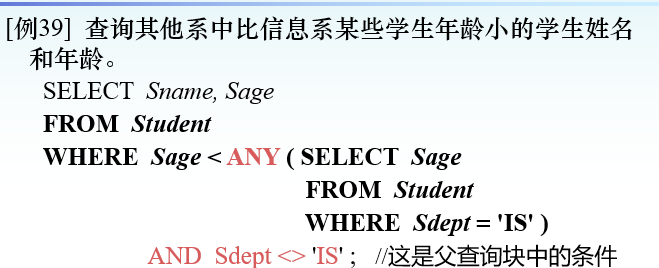

使用any/all谓词与集函数具有等价关系, 而用**集函数查询通常比any/all查询效率高**因为前者可以减少比较次数

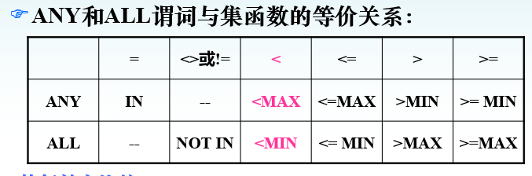

#### 带有EXISTS谓词的子查询

exists仅返回true/false, 故子查询通常只用`select *`

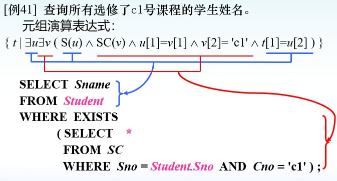

使用**EXISTS子查询的效率要优于使用连接查询和IN查询**

EXISTS通常引入的是相关子查询, 而IN更多的是不相关子查询

### 集合查询

集合操作命令

| 命令      |      |
| --------- | ---- |
| UNION     | 并   |
| INTERSECT | 交   |
| MINUS     | 差   |

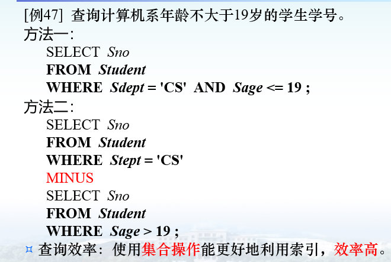

## 3 | 数据更新

### 3-1 | 插入数据

#### 插入单个结果

格式:

```sql
INSERT
INTO <表明> <属性列s>
VALUES <常量s>;
```

如果不指定属性列, 则values必须以完整的元组插入, 且属性与表中属性顺序一致

举例:

```sql
insert into sc(sno, cno)
values ('95001', '1');
```

#### 插入子查询结果

```sql
INSERT
INTO <表名> <属性列s>
子查询;
```

举例:

```sql
INSERT
INTO  Deptage ( Sdept, Avgage )
		SELECT  Sdept, AVG(Sage)  -- 属性个数要匹配
		FROM  Student
		GROUP  BY  Sdept ;
```

#### 注意完整性约束

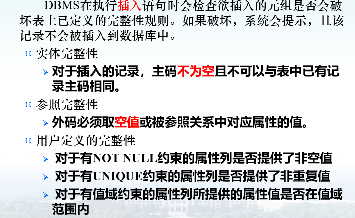

### 3-2 | 修改数据

格式:

```sql
UPDATE <表名>
SET <列名> = <表达式>
WHERE <条件>
```

举例:

```sql
update student
set sage = 22
where sno = '95001'
```

```sql
-- 将所有学生年龄增加一岁
update student
set sage = sage + 1
```

### 3-3 | 删除数据

格式:

```sql
DELETE 
FROM <表名>
WHERE <条件>;
```

删除表中满足where指定条件的元组

例子:

```sql
delete
from student
where sno = '95001';
```

```sql
-- 删除所有学生的选课记录
delete
from sc;
```

```sql
-- 删除CS系所有学生的选课记录
delete 
from sc
where sno in (
	select sno
    from student
    where student.sdept = 'CS'
);
```

删除时的参照完整性:

- 不允许被删除
- 级联删除 ( 通过CASCADE参数指定 )

## 4 | 视图

数据库系统的**三级模式**: 外模式, 模式, 内模式

数据库系统的**两级映像**: 外模式-模式映像 模式-内模式映像

- 外模式-模式映像用途: **保证数据的逻辑独立性**

- 模式-内模式映像用途: **保证数据的物理独立性**

视图对应的就是三级模式/两级映像体系结构中的外模式和外模式/模式映像

### 4-1 | 建立视图

格式:

```sql
CREATE VIEW <视图名> <列名>
AS <子查询>
[WITH CHECK OPTION];
```

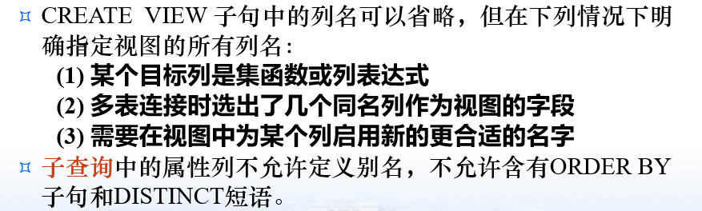

DBMS执行create view语句时只是把视图的定义存入数据字典, 并不执行其中的select语句, 在对视图查询时, 按视图的定义从基本表中将

数据查出

例子:

```sql
create view IS_STUDENT
as
select sno, sname, sage
from student
where sdept = 'IS';
```

若一个视图是从单个基本表导出的, 并且只去掉了基本表的某些行和某些列但保留了码, 则这类视图称为**行列子集视图**, 上例所建立的视图就是行列子集视图

#### DBMS实现视图查询的方法

1. **实体化视图:** 通过视图建立临时表, 查询后删除临时表
2. **视图消解法:** 根据视图定义将对视图的查询转换为对基本表的查询

