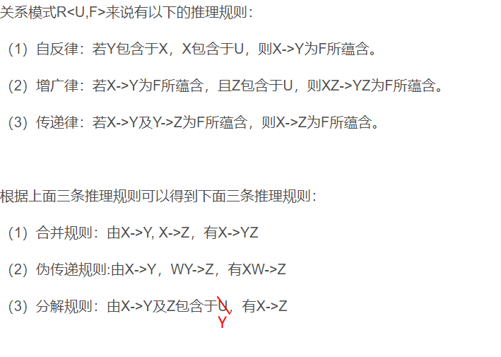

# 06. 关系数据理论

**关系模式的简记**: R <U, F>

其中U表示属性集, F表示数据依赖

## 1 | 关系模式的存储异常

不满足2NF, 3NF, BCNF范式的关系模式存在下列异常

- 数据冗余
- 更新异常
- 插入异常
- 删除异常

## 2 | 函数依赖

Functional Dependencies简写为FD

- **平凡函数依赖**: ($\text{X}->\text{Y}, \text{Y}\subseteq \text{X}$) 平凡函数依赖没什么用, 不研究
- 例如(sno, cno)->sno
- **非平凡函数依赖**: ($\text{X}->\text{Y}, \text{Y}\nsubseteq \text{X}$) 如果不特别声明, 我们总是讨论非平凡函数依赖
  - 例如(sno, cno)->grade

- **完全函数依赖, 部分函数依赖**
- **传递函数依赖**: (A->B B->C), 则Z传递依赖于X, 注意Y$\nrightarrow $X如果Y$\rightarrow$X
  则为直接依赖

## 3 | 范式

### 1NF

所有属性必须是原子的, 不允许表中套表

### 2NF

满足1NF且不存在属性对候选码的部分函数依赖

### 3NF

满足2NF且不存在属性对候选码的传递函数依赖

### BCNF

对于R<U, F>的每一个函数依赖X->Y, **X必包含码**

## 4 | Armstrong公理系统

### 六条推理规则 

- 自反律
- 增广律
- 传递律
- 合并规则
- 分解规则
- 伪传递规则

### 函数依赖集的闭包

在关系模式R<U, F>中为F所逻辑蕴含的函数依赖的全体叫做F的闭包, 记为$\text{F}^+$

