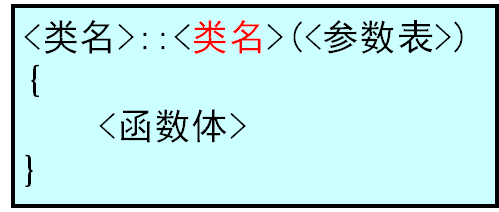
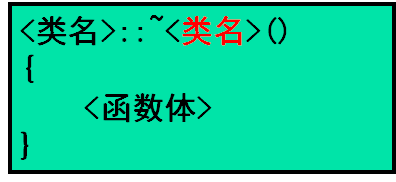
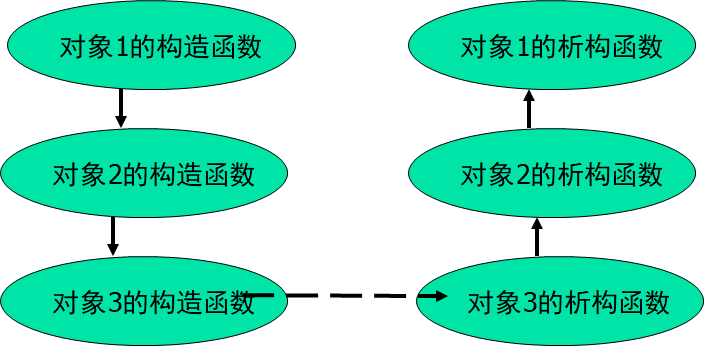
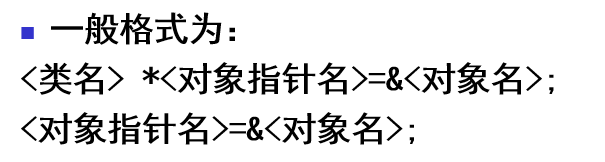
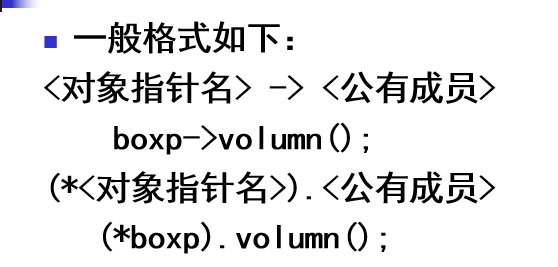
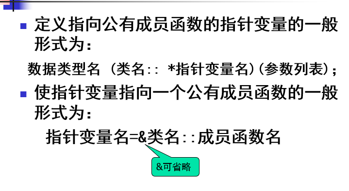
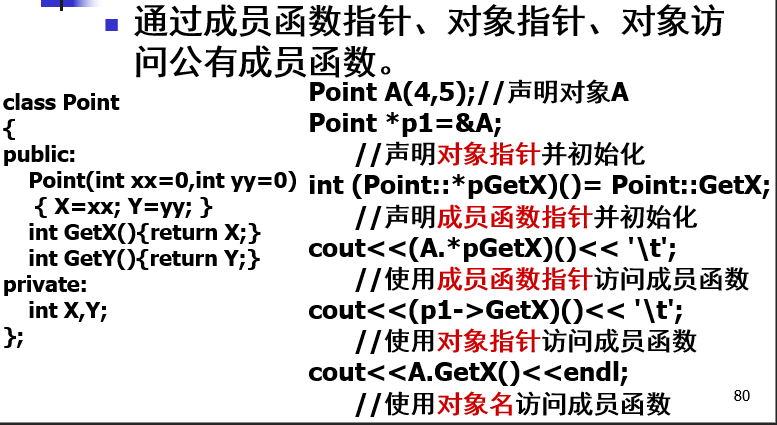
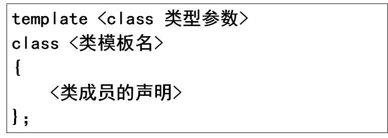
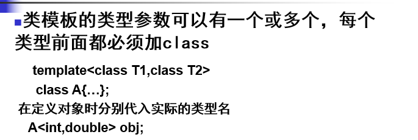
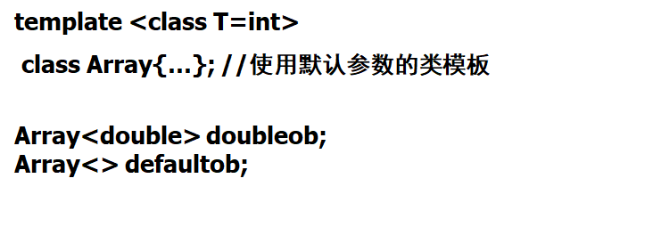

#  03. 使用类和对象

## 1 | 构造函数和析构函数

### 构造函数: 

**在定义对象时被编译系统自动调用来创建对象并初始化对象**

定义:



- 如果在类中没有显式定义构造函数, 那么编译系统就会自动生成一个默认形式的构造函数, 这个构造函数的功能仅用于创建对象, 并不会对产生对象的数据成员赋初值, 即产生对象的数据成员的值是**不确定的**
- 只要显式定义了一个类的构造函数, 则编译器就不产生默认的构造函数

### 析构函数:

**析构函数的功能是在对象的生存期即将结束的时刻，由编译系统自动调用来完成一些清理工作。**

析构函数只是在生命周期末端完成一些清理工作，并不会回收空间。这个空间应该是系统管理释放。析构函数不能有参数，因此也不能被重载；

定义:



如果没有定义析构函数，同构造函数一样，编译系统会提供默认形式的析构函数

### 析构函数和构造函数的调用顺序

在一般情况下，调用构造函数与声明对象的顺序相同，而调用析构函数的次序正好与创建对象的顺序相反。



### 对象的复制和复制构造函数

#### 赋值和复制

生成一个对象的副本有两种途径:

1. **对象的赋值**

   `<对象1> = <对象2>`, 其中对象1, 2都是已经存在的对象

2. **对象的复制**

   `<类名> <对象2> (<对象1>)`

   `<类名> <对象2> = <对象1>`

前者是对一个已经存在的对象赋值, 而后者是**从无到有**地建立一个新对象

#### 复制构造函数

一种特殊的构造函数, 它的功能是**用一个已知的对象来初始化一个被定义的同类的对象**

格式:

```cpp
// 复制构造函数只有一个参数，并且是对同类对象的引用。
<类名> (const <类名>& <对象名>) {
    ...;
}
```

- 如果程序员没有显式定义复制构造函数, 编译系统会自动生成一个默认形式的复制构造函数, 其功能是把已知对象的每个值都复制到新创建的对象中, 而不做其他的处理

```cpp
Box();            //无参构造函数

Box(int h,int w ,int len):height(h),width(w),length(len){}
                  //带参构造函数

Box(const Box& b);//复制构造函数
```

## 2 | 类的静态成员

- 静态成员是类的所有对象共享的成员，而不是某个对象的成员，它在对象中不占存储空间，是属于整个类的成员。

### 静态数据成员

- 静态数据成员不随对象的建立而分配空间，也不随对象的撤销而释放。它是在程序编译时分配空间，到程序结束时才释放空间。 

**定义**:

 `static xxx`

**初始化**:

 `<数据类型> <类名>::<静态数据成员名>=<值>;` (初始化语句中不能加static)

**访问**:

- 在成员函数中直接访问
- 在类外必须使用**成员访问运算符**或者**域运算符**访问**共有静态数据成员**

`对象名.静态数据成员` 或者 `类名::静态数据成员`

### 静态成员函数

- 静态成员函数的作用是为了能处理静态数据成员
- 静态成员函数没有this指针
- 静态成员函数可以**直接访问**该类的静态成员, 但不能直接访问类中的**非静态成员**, 如果要使用非静态成员需要以参数传递的方式得到对象名然后通过对象名进行访问

## 3 | 对象指针

初始化:



通过对象指针访问对象成员:



## 4 | this指针

- this指针是一种特殊的隐含指针, 它隐含于每一个成员函数中, 也就是说, **每一个成员函数都有一个this指针参数**

- this指针指向调用该函数的对象, 即this指针的值是**当前被调用的成员函数所在对象的起始地址**

- 但一个对象调用成员函数时, 编译系统先将对象的地址赋给this指针, 然后调用成员函数, 每次成员函数存取数据成员时则隐含使用this指针
- 通常不显式地使用this指针来调用数据成员

## 5 | 成员函数指针





## 6 | 常对象

> 常对象是其数据成员值在对象的整个生存期间内不能被改变的对象。

常对象的定义:

```cpp
// 方式一
const  <类名>　<对象名>(<初始化值>);
// 方式二
<类名> const <对象名>(<初始化值>);
```

- 常对象**不能调用普通的成员函数, 可以调用常成员函数**

## 7 | 类的常成员

> 类的数据成员和成员函数可以声明为const, 分别为常数据成员和常成员函数

### 常数据成员

- **「只读」:**在任何函数中都不允许对常数据成员赋值
- **只能**通过构造函数的**参数初始化表**对常数据成员进行初始化
- 类的所有对象中的常数据成员值均不能改变, 但不同对象中的该值可以不同

```cpp
class A {
public:
    const int n = 10; // c++11之前的标准不支持, 所有数据成员都不能定义时初始化, 只能在初始化列表初始化, c++11之后可以定义时赋初值, 然后可以在构造函数中覆盖
    A (int x): n(x) {}
    A (){}
};

int main() {
    A a;
    A b(30);
    cout << a.n << ' ' << b.n << endl; // 10 30
    a.n = 10; // error: assignment of read-only member 'A::n'
}
```

### 常成员函数

```cpp
<数据类型> <函数名> (<参数表>) const; // 声明与定义时都要加const, 调用时不必加const

//e.g.
int show () const {
    cout << "hh" << endl;
}
```

- 常成员函数不能更新对象的数据成员, 也**不能调用该类中的非const成员函数**

- 常对象只能调用它的常成员函数而不能调用其他成员函数
- const关键字可以用于对重载函数的区分

## 8 | const和指针

### 指向对象的常指针

`类名 * const 指针名 = 对象地址`

表示**指针不能改变指向**

### 指向常对象的指针

`const 类名 * 指针名 = 对象地址`

如果存在一个常对象, 则**只能用指向常对象的指针指向它**

指向常对象的指针还可以指向非const的对象, 但是不能通过指针改变对象的值

即, 指向常对象的指针可以指向const和非const型的对象，而指向非const型对象的指针只能指向非const的对象。

### 常引用


## 9 | 对象数组

声明对象数组的格式`<类名><数组名>[<下表表达式>]`

- 如果构造函数只有一个参数，在定义数组时可以直接在等号后面的大括号内提供实参。

```cpp
student stud[3] = {60, 70, 78};
```

- 如果构造函数有多个参数，在定义对象数组时在大括号中分别写出构造函数并指定实参。

```cpp
Ex(int x=0, char c=‘c’);  //声明构造函数
Ex z[2]={Ex(10,'a'),Ex(1,'d')}; //对象数组的初始化
```

## 10 | 对象成员

> 用类对象作为另一个类的成员, 这个成员成为**对象成员**或者**子对象**

对象成员的初始化:

1. 在构造函数成员初始化表中初始化
2. 在构造函数体内初始化

说明:

- 一般而言在类中出现了对象成员时, 创建本类对象既要对本类的数据成员进行初始化, 又要对对象成员进行初始化
- **构造函数的调用顺序:** 先调用对象成员的构造函数再调用本类的构造函数, 析构函数的调用顺序则相反
- 如果调用本类默认形式的构造函数那么也只能调用对象成员默认形式的构造函数

## 11 | 类模板

> 类模板是对一批仅有成员数据类型不同的类的抽象



由类模板实例化生成的类叫模板类

注意:

- 在类模板外定义成员函数时, 每一个函数前均要加上`template <class 类型参数>`

e.g.


- 在定义对象时需要带入实际的类型名

e.g.



- 类模板可以包含与通用类型相关的默认参数, 如果没有指定其他的数据类型就使用默认类型

