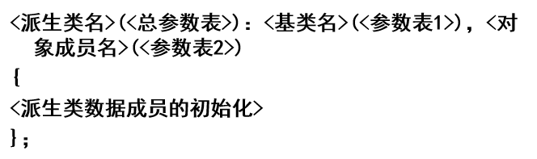
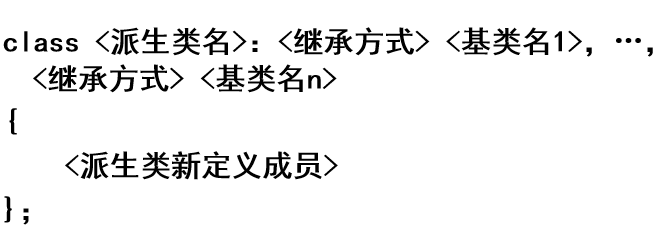

# 05. 继承与派生

## 1 | 类的三种继承方式

类有三种继承方式: `public` `protected` `private`

默认情况下为`private`继承

三种继承方式下基类成员的访问控制权限:

| **继承**  **成员** | **公有继承**           | **私有继承**           | **保护继承**           |
| ------------------ | ---------------------- | ---------------------- | ---------------------- |
| **公有成员**       | **公有**               | **私有**               | **保护**               |
| **私有成员**       | **派生类成员不可访问** | **派生类成员不可访问** | **派生类成员不可访问** |
| **保护成员**       | **保护**               | **私有**               | **保护**               |

- 无论哪种继承方式, 基类的私有成员在派生类中都是不可访问的, 只有通过基类的成员函数访问基类的私有成员; 如果要在派生类中访问基类私有成员, 可以将派生类声明为基类的友元

## 2 | 派生类的构造函数和析构函数

**不能在派生类的构造函数体中显式调用基类构造函数来初始化基类成员**

解决办法: 使用**成员初始化表**调用基类构造函数

格式:



- 当基类没有显式定义构造函数或者定义无参构造函数时, 派生类可以省略对基类构造函数的调用

### 构造函数和析构函数的调用顺序

调用顺序为:

基类的构造函数 -> 对象成员构造函数 -> 派生类构造函数

析构函数顺序相反 (栈)

## 3 | 多继承和虚基类

> 当派生类有多个基类时成为多继承



- 在多继承时的构造函数调用顺序为**定义派生类时所指定的基类顺序**, 与派生类构造函数中所定义的**成员初始化列表顺序无关**

- 如果有多个成员类对象, 则构造函数的调用顺序是对象**在类中被声明的顺序**而不是它们出现在成员初始化表中的顺序

### 虚基类

> 为了避免**对基类成员访问的二义性**问题, 可以将直接基类的共同基类设置为虚基类, 这样共同基类在内存中只有一个副本存在

虚基类的定义格式为:

`class A: virtual public B;`

应当在基类的所有派生类中声明为虚基类, 否则仍然会出现对基类的多次继承

### 构造函数的调用顺序

- 先调用虚基类的构造函数, 再调用非虚基类的构造函数
- 若同一层次中包含多个虚基类, 其调用顺序为定义时的顺序
- 若虚基类由非虚基类派生而来, 则仍按先调用基类构造函数再调用派生类构造函数的顺序

### 虚基类的初始化

如果在虚基类中只定义了带参数的构造函数, 则需要在其**所有派生类**中, 通过构造函数的初始化表对虚基类进行初始化

```cpp
class base {
public:
    base (int x) {
        cout << "constructor " << x << endl;
    }
};


class a:virtual public base {
public:
    a (int n):base(4) {
        cout << "A constructor" << endl;
    }
};

class b: virtual public base, public a {
public:
    b (int n):base(n), a(2) {
        cout << "B constructor" << endl;
    }
};

int main() {
    // 都需要对虚基类初始化, 但因为先通过b的初始化表调用base构造函数
    b x(5);
    return 0;
}
/*
输出为:
constructor 5
A constructor
B constructor
*/
```


