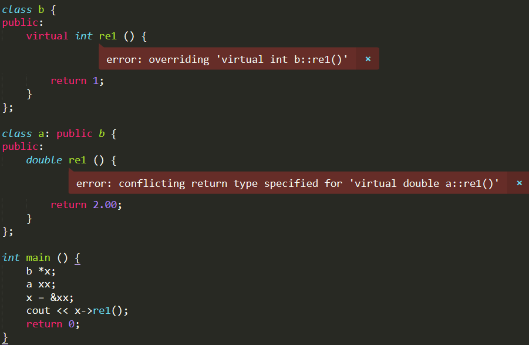

# 06. 多态和虚函数

## 1 | 类型兼容规则

> 类型兼容规则是指在需要基类对象的任何地方，都可以使用公有派生类的对象来替代。

「替代」

- 派生类的对象可以赋值给基类的对象
- 派生类的对象可以初始化基类的引用
- 派生类的对象地址可以赋值给基类的指针变量

## 2 | 多态

> 「多态(Polymorphism)」是指具有相似功能的不同函数用一个名称来实现, 从而可以使用相同的调用方式来调用这些具有不同功能的同名函数的特性

两类多态:

| 名称       | 实现方式 |
| ---------- | -------- |
| 静态多态性 | 函数重载 |
| 动态多态性 | 虚函数   |

### 联编

c++采用联编技术来支持多态

> 联编: 把一个标识符名和一个存储地址联系在一起的过程, 在多态的实现过程中, 确定调用哪个同名函数的过程就是联编, 又称为绑定

联编的分类 (按照联编进行的阶段):

| 名称     | 含义                                                         |
| -------- | ------------------------------------------------------------ |
| 静态联编 | 在编译阶段完成的联编, 通常在重载时使用 -- 「编译时多态」     |
| 动态联编 | 在程序执行的过程中根据具体情况动态决定, 在运行阶段完成的联编 -- 「运行时多态」 |

## 3 | 虚函数

当不用虚函数时, 若一个基类指针指向派生类, 调用的同名函数还是基类的方法

虚函数的使用:

- 类之间应满足类型兼容规则
- 同名声明虚函数
- 通过指针和引用来访问虚函数

声明虚函数的格式如下:

`virtual <函数值类型> <函数名> (<参数表>) `

虚函数为一个类簇中的所有派生类的同一行为提供了统一的接口, 使得程序按在使用一个类簇时只需记住一个接口即可

### 访问派生类的同名函数:

1. 将基类中的同名函数定义为虚函数
2. 将不同的派生类对象地址赋给基类的指针变量

### 例子

```cpp
class base {
public:
    virtual void show () {
        cout << "Im base" << endl;
    }
};

class child: public base {
public:
    void show () { // 派生类可以省略virtual
        cout << "Im child" << endl;
    }
};

int main() {
    base *basePtr;
    base b;
    child c;
    basePtr = &b;
    basePtr->show(); // Im base
    basePtr = &c;
    basePtr->show(); // Im child
    return 0;
}
```

注:

- 一个函数一旦被声明为虚函数，则无论声明它的类被继承了多少层，在每一层派生类中该函数都保持虚函数特性。因此，在派生类中重新定义该函数时，可以省略关键字virtual。

- 当虚函数的声明与实现分开时, `virtual`关键字只能用在虚函数的声明中而不能用在虚函数的实现中

```cpp
class B {
public:
virtual void print (); // 声明
};

// error: 'virtual' outside class declaration
virtual void B::print() { // 错误的方式
cout << "xx" << endl;
}

void B::print() {	// 正确的方式
cout << "yy" << endl;
}
```

### 注意

- 静态函数和友元函数不能声明为虚函数, 因为他们不属于某一个对象
- 内联成员函数不能声明为虚函数, 因为在编译时已经被替换
- 构造函数不能是虚函数, 析构函数可以是虚函数

- 当在派生类中定义了虚函数的重载函数，但并没有重新定义虚函数时，与虚函数同名的重载函数覆盖了派生类中的虚函数。此时试图通过派生类对象、指针、引用调用派生类的虚函数就会产生错误。

  e.g.

  

## 4 | 纯虚函数

> 纯虚函数用virtual声明，没有任何实现、必须由派生类重新定义该函数提供实现

格式: 

`virtual <返回值> <函数名> (<参数表>) = 0`

纯虚函数不需要定义实现方法, 它的存在只是为了在派生类中被重新定义, 提供给一个多态的接口

### 抽象类

- 包含一个或者多个纯虚函数的类成为抽象类
- 如果派生类没有实现基类中**所有的纯虚函数**, 则派生类也是抽象类
- 抽象类无法实例化, 即**无法创建抽象类的对象**, 但是**可以声明抽象类的指针或引用**, 通过指针和引用来指向并访问派生类对象, 从而实现动态多态


